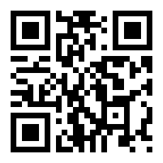

+++
title = 'Datenschutzoptimierung im Mobilfunk'
date = 2024-05-21T22:25:00+02:00
draft = false
author = "Frank Tornack"
tags = [
    "Datenschutz",
    "Tracking",
    "Mobilfunk",
    "Telekom",
    "Vodafone",
    "O2",
]
+++

Viele Nutzer die diesen Text lesen werden sind wie ich an Datenschutz und Datensparsamkeit interessiert, sind aber gleichzeitig durch Banken und andere digitale Dienste vom Mobilfunk abhänig. In Deutschland & EU fühlt man sich durch die verankerten Opt-In-Verfahren eigentlich in Sicherheit. Doch nun habe ich bei den führenden Mobilfunkanbietern in Deutschland einer Partnerschaft mit [Utiq](https://utiq.com/) entdeckt.
<!--more-->

# Was ist Utiq?
Utiq ist nach eigenen Angaben ein datenschutzfreundlicher Werbeidentifikator, der auf einer Zusammenarbeit zwischen Telekommunikationsunternehmen basiert. Ziel des Unternehmens es, personalisierte Werbung und Empfehlungen auf Basis pseudonymisierter Profile zu ermöglichen.

# Welche Probleme sehe ich bei Utiq
Nach der Zustimmung auf einer teilnehmenden Website ist die Datenerfassung auf allen Websiten möglich. Dazu wird ein pseudonymes Signal an die Website zur Wiedererkennung gesendet. Auch wenn der Anbieter die Möglichkeit bietet die versehentliche Aktivierung zu unterbinden, so muss man diesen Opt-Out jahrlich erneuern. Außerdem werden alle Nutzer die über die Hotspot-Funktion des Handy ans Internet angebunden sind ermächtigt diese Sperre aufzuheben.

# Wie richte ich eine Utiq-Sperre ein
Der Anbieter stellt mit seiner Platform [consenthub](https://consenthub.utiq.com/) die Möglichkeit bereit, die Aktvierung des Services zu unterbinden. Da die Authentifizierung auf diesem Portal über Daten des Telekommunikationsanbieter erfolgt, bedarf es einer Verbindung über das Mobilfunknetz. Man muss das Telefon also vom heimischen WLAN trennen und VPN-Dienste abschalten. Sind die Voraussetzungen geschaffen, kann man auf der Website seine getätigten Einwilligungen verwalten und eine Sperre für ein Jahr einrichten.

Für Leser die gerade nicht das Smartphone zum lesen nutzen... hier nochmal der Link:

Und am Besten gleich für nächstes Jahr einen Termin in den Kalender schreiben... [Kalenderdatei](UtiqSperreErneuern.ics)

# Was ist der Ziel dieses Beitrags?
Mit meinem Text möchte ich möglichst viele Menschen ermutigen eine Sperre einzurichten und damit ein Zeichen gegen Datensammeldienste setzen. Jede gesammelte Information bietet auch Missbrauchspotential, das ist vielen Nutzern nicht bewusst. Ich hoffe hier mehrere Augen zu öffnen.